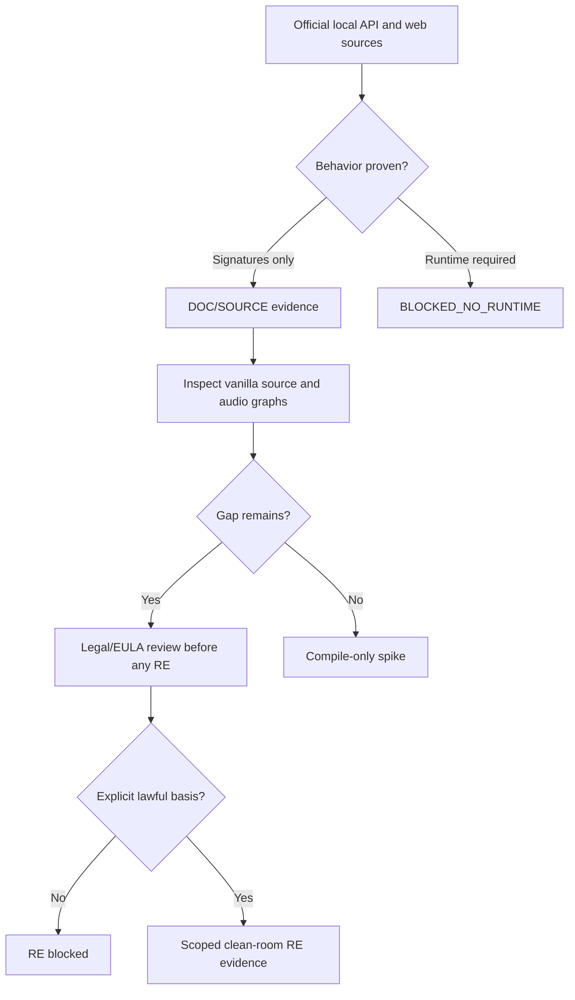

```mermaid
flowchart TD
    A[Official local API and web sources] --> B{Behavior proven?}
    B -->|Signatures only| C[DOC/SOURCE evidence]
    B -->|Runtime required| D[BLOCKED_NO_RUNTIME]
    C --> E[Inspect vanilla source and audio graphs]
    E --> F{Gap remains?}
    F -->|Yes| G[Legal/EULA review before any RE]
    F -->|No| H[Compile-only spike]
    G --> I{Explicit lawful basis?}
    I -->|No| J[RE blocked]
    I -->|Yes| K[Scoped clean-room RE evidence]
```

