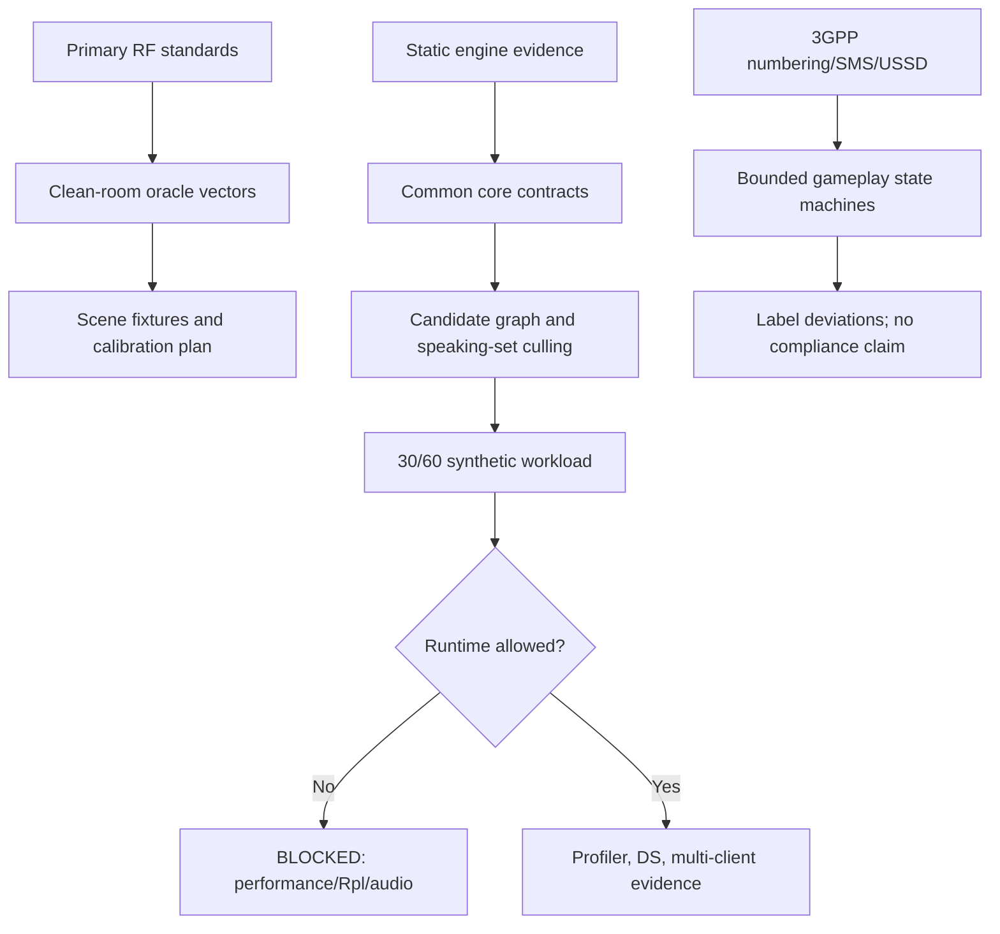

```mermaid
flowchart TD
    A[Static engine evidence] --> B[Common core contracts]
    C[Primary RF standards] --> D[Clean-room oracle vectors]
    D --> E[Scene fixtures and calibration plan]
    B --> F[Candidate graph and speaking-set culling]
    F --> G[30/60 synthetic workload]
    G --> H{Runtime allowed?}
    H -->|No| I[BLOCKED: performance/Rpl/audio]
    H -->|Yes| J[Profiler, DS, multi-client evidence]
    K[3GPP numbering/SMS/USSD] --> L[Bounded gameplay state machines]
    L --> M[Label deviations; no compliance claim]
```

