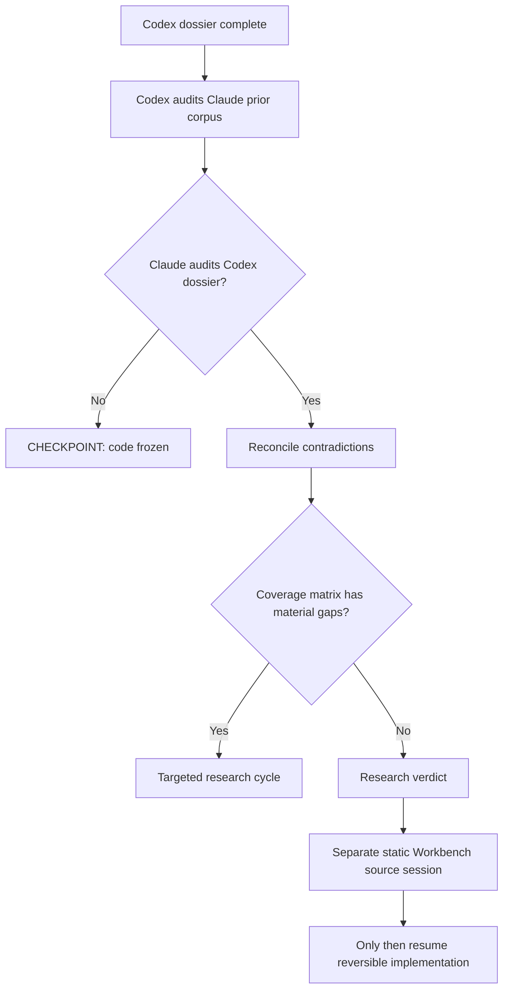

```mermaid
flowchart TD
    A[Codex dossier complete] --> B[Codex audits Claude prior corpus]
    B --> C{Claude audits Codex dossier?}
    C -->|No| D[CHECKPOINT: code frozen]
    C -->|Yes| E[Reconcile contradictions]
    E --> F{Coverage matrix has material gaps?}
    F -->|Yes| G[Targeted research cycle]
    F -->|No| H[Research verdict]
    H --> I[Separate static Workbench source session]
    I --> J[Only then resume reversible implementation]
```

