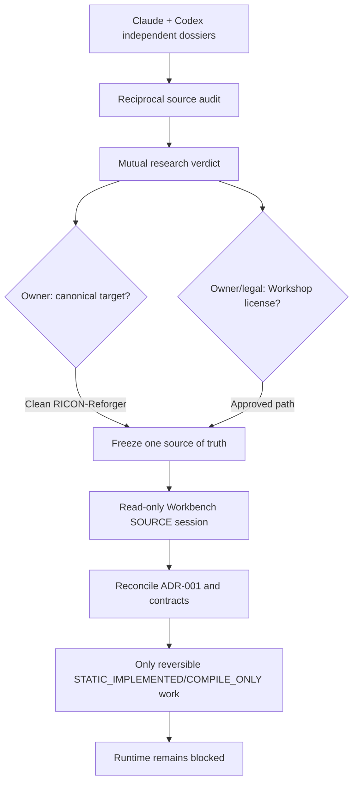

```mermaid
flowchart TD
    A[Claude + Codex independent dossiers] --> B[Reciprocal source audit]
    B --> C[Mutual research verdict]
    C --> D{Owner: canonical target?}
    C --> E{Owner/legal: Workshop license?}
    D -->|Clean RICON-Reforger| F[Freeze one source of truth]
    E -->|Approved path| F
    F --> G[Read-only Workbench SOURCE session]
    G --> H[Reconcile ADR-001 and contracts]
    H --> I[Only reversible STATIC_IMPLEMENTED/COMPILE_ONLY work]
    I --> J[Runtime remains blocked]
```

