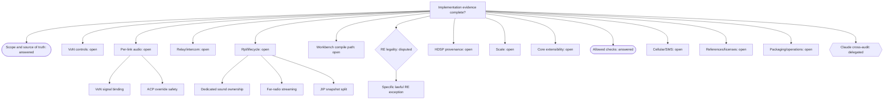

```mermaid
flowchart TD
    q000[Implementation evidence complete?]
    q001([Scope and source of truth: answered])
    q002[VoN controls: open]
    q003[Per-link audio: open]
    q004[Relay/intercom: open]
    q005[Rpl/lifecycle: open]
    q006[Workbench compile path: open]
    q007{RE legality: disputed}
    q008[HDSP provenance: open]
    q009[Scale: open]
    q010[Core extensibility: open]
    q011([Allowed checks: answered])
    q012[Cellular/SMS: open]
    q013[References/licenses: open]
    q014[Packaging/operations: open]
    q015{{Claude cross-audit: delegated}}
    q016[VoN signal binding]
    q017[ACP override safety]
    q018[Dedicated sound ownership]
    q019[Far-radio streaming]
    q020[JIP snapshot split]
    q021[Specific lawful RE exception]
    q000 --> q001 & q002 & q003 & q004 & q005 & q006 & q007 & q008 & q009 & q010 & q011 & q012 & q013 & q014 & q015
    q003 --> q016 & q017
    q005 --> q018 & q019 & q020
    q007 --> q021
```

