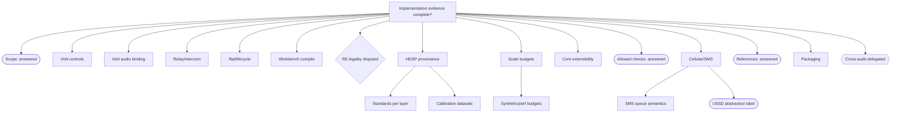

```mermaid
flowchart TD
    q000[Implementation evidence complete?]
    q001([Scope: answered])
    q002[VoN controls]
    q003[VoN audio binding]
    q004[Relay/intercom]
    q005[Rpl/lifecycle]
    q006[Workbench compile]
    q007{RE legality disputed}
    q008[HDSP provenance]
    q009[Scale budgets]
    q010[Core extensibility]
    q011([Allowed checks: answered])
    q012[Cellular/SMS]
    q013([References: answered])
    q014[Packaging]
    q015{{Cross-audit delegated}}
    q022[Standards per layer]
    q023[Calibration datasets]
    q024[Synthetic/perf budgets]
    q025[SMS queue semantics]
    q026([USSD abstraction label])
    q000 --> q001 & q002 & q003 & q004 & q005 & q006 & q007 & q008 & q009 & q010 & q011 & q012 & q013 & q014 & q015
    q008 --> q022 & q023
    q009 --> q024
    q012 --> q025 & q026
```

