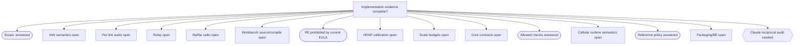

```mermaid
flowchart TD
    q000[Implementation evidence complete?]
    q001([Scope: answered])
    q002[VoN semantics open]
    q003[Per-link audio open]
    q004[Relay open]
    q005[Rpl/far radio open]
    q006[Workbench source/compile open]
    q007([RE prohibited by current EULA])
    q008[HDSP calibration open]
    q009[Scale budgets open]
    q010[Core contracts open]
    q011([Allowed checks answered])
    q012[Cellular runtime semantics open]
    q013([Reference policy answered])
    q014[Packaging/BE open]
    q015{{Claude reciprocal audit needed}}
    q000 --> q001 & q002 & q003 & q004 & q005 & q006 & q007 & q008 & q009 & q010 & q011 & q012 & q013 & q014 & q015
```

