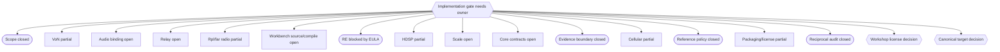

```mermaid
flowchart TD
    q000{{Implementation gate needs owner}}
    q001([Scope closed])
    q002[VoN partial]
    q003[Audio binding open]
    q004[Relay open]
    q005[Rpl/far radio partial]
    q006[Workbench source/compile open]
    q007([RE blocked by EULA])
    q008[HDSP partial]
    q009[Scale open]
    q010[Core contracts open]
    q011([Evidence boundary closed])
    q012[Cellular partial]
    q013([Reference policy closed])
    q014[Packaging/license partial]
    q015([Reciprocal audit closed])
    q027{{Workshop license decision}}
    q028{{Canonical target decision}}
    q000 --> q001 & q002 & q003 & q004 & q005 & q006 & q007 & q008 & q009 & q010 & q011 & q012 & q013 & q014 & q015 & q027 & q028
```

