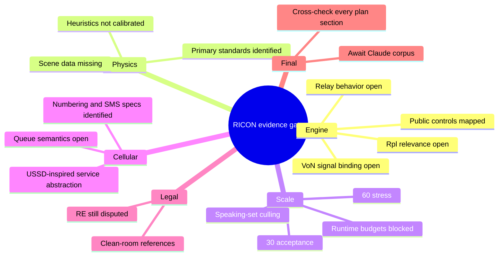

```mermaid
mindmap
  root((RICON evidence gate))
    Engine
      Public controls mapped
      VoN signal binding open
      Relay behavior open
      Rpl relevance open
    Physics
      Primary standards identified
      Heuristics not calibrated
      Scene data missing
    Scale
      30 acceptance
      60 stress
      Speaking-set culling
      Runtime budgets blocked
    Cellular
      Numbering and SMS specs identified
      USSD-inspired service abstraction
      Queue semantics open
    Legal
      Clean-room references
      RE still disputed
    Final
      Await Claude corpus
      Cross-check every plan section
```

