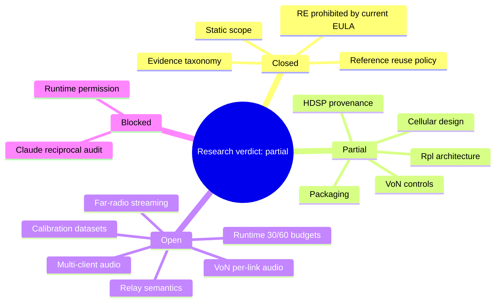

```mermaid
mindmap
  root((Research verdict: partial))
    Closed
      Static scope
      Evidence taxonomy
      Reference reuse policy
      RE prohibited by current EULA
    Partial
      VoN controls
      Rpl architecture
      HDSP provenance
      Cellular design
      Packaging
    Open
      VoN per-link audio
      Relay semantics
      Far-radio streaming
      Calibration datasets
      Runtime 30/60 budgets
      Multi-client audio
    Blocked
      Claude reciprocal audit
      Runtime permission
```

