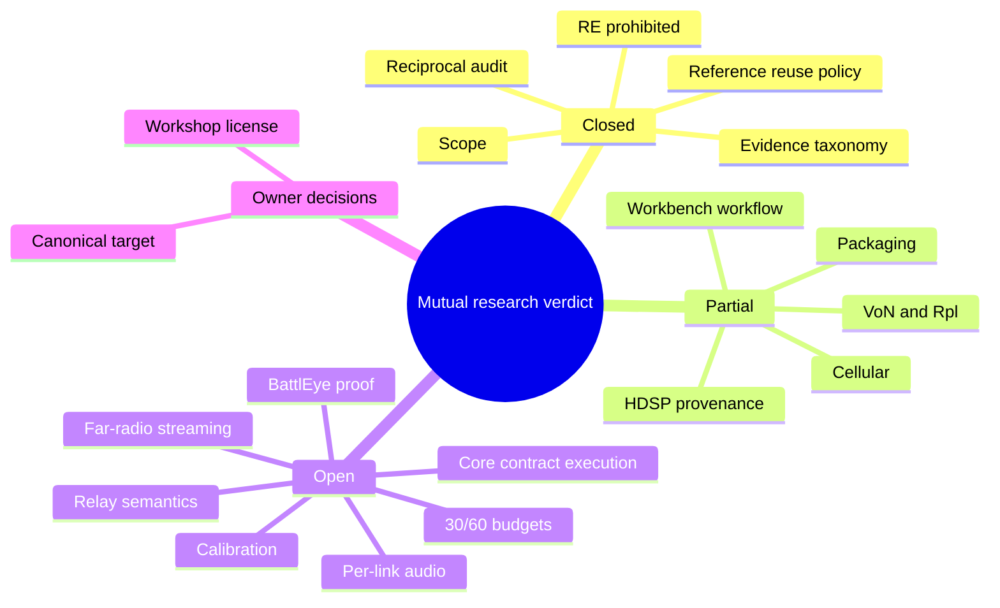

```mermaid
mindmap
  root((Mutual research verdict))
    Closed
      Reciprocal audit
      Scope
      Reference reuse policy
      Evidence taxonomy
      RE prohibited
    Partial
      VoN and Rpl
      Workbench workflow
      HDSP provenance
      Cellular
      Packaging
    Open
      Per-link audio
      Relay semantics
      Far-radio streaming
      Calibration
      30/60 budgets
      Core contract execution
      BattlEye proof
    Owner decisions
      Workshop license
      Canonical target
```

